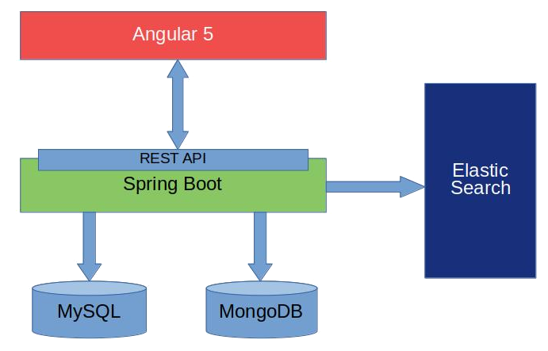
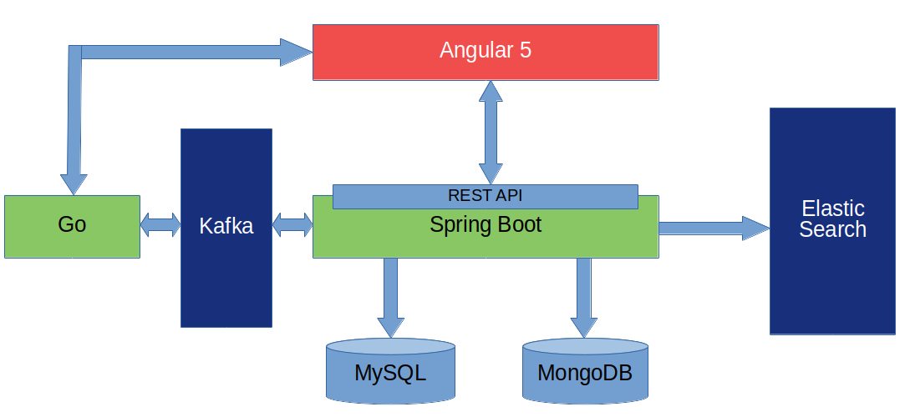

# EJEMPLO PRÁCTICO DE GO

## Introducción

### ¿Qué es Go?

Go, también conocido como GoLang, es un lenguage de programación creado por Google de propósito general con una sintaxis clara que, en algunos aspectos, recuerda a C. Es un lenguaje de programación concurrente compilado, de tipado estático y con soporte al uso de punteros. Además, dispone de mecanismos de recolección de basura para eliminar referencias a objetos dereferenciados.

### Puntos positivos de Go

Entre las principales virtudes de Go, cabe destacar:

* __Su velocidad:__ Go es un lenguaje compilado a código máquina, por lo que no necesita una máquina virtual para su ejecución. Además, la compilación de una aplicación en Go es extremadamente rápida y el ejecutable que se genera tiene un tamaño muy reducido
* __Soporte a interfaces:__ aunque Go no es un lenguaje orientado a objetos (no soporta herencia), sí soporta la definición e implementación por parte de estructuras de cualquier interfaz que hayamos definido, por lo que no tendremos un acomplamiento fuerte entre dependencias si trabajamos con interfaces.
* __Gestión de la multitarea y paralelización:__ mediante el uso de lo que se conoce como `goroutines` es extremadamente sencillo y eficiente arrancar la ejecución de un bloque de código en paralelo.

### Puntos negativos de Go

* __Soporte a librerías:__ existe una clara carencia en cuanto a librerías ofrecidas por terceros para facilitar la integración de nuestra aplicación con sistemas externos.
* __Comunidad fracturada:__ en parte relacionado con el punto anterior, dada la falta de frameworks y estándares, puedes encontrar multitud de librerías, implementadas en su mayoría por particulares, que resuelven un mismo problema.
* __Configuración inicial:__ la entrada para alguien inexperto puede ser bastante complicada por la dificultad que supone montar el entorno de desarrollo y, si bien con la publicación de `godep` se ha arreglado bastante, por lo complicada que es la gestión de dependencias.
* __Implementación de interfaces implícito:__ no hay una sintaxis específica para indicar que  un struct implementa un interface definido, la implementación es implícita, por lo que si hacemos cambios en la interface no siempre sabremos qué tipos hemos de modificar para adaptarlos a esa interface.

## Caso de uso

Actualmente se dispone de un aplicación desarrollada con Spring Boot en su backend y con Angular 4 en su frontend para la gestión, entre otras cosas, de distintos eventos asociados a pruebas deportivas. Se quiere ofrecer a los usuarios la posibilidad de indicar si quieren recibir, para aquellos campeonatos que sean de su interés y con una antelación determinada, de los eventos que estén próximos a suceder. Igualmente, también se ofrece la posibilidad de que puedan recibir notificaciones cada vez que se cargue en el sistema los resultados de un evento.

Así pues, existirán dos líneas principales de desarrollo:

* Desarrollo del servicio REST que de soporte a las operaciones CRUD necesarias para que los usuarios gestionen sus suscripciones
* Generación y envío de las notificaciones al dispositivo móvil de los usuarios

### Arquitectura actual del sistema

 

### Arquitectura propuesta

 

### Desarrollo

#### Modelo asociado

Go dispone de una serie de tipos nativos con los que trabajar (int, string, bool...) pero también nos permite crear nuestros propios tipos mediante el declaración de tipos estructurados (`struct`) en el que se incluye la definición de atributos con nombre.

En el caso que nos ocupa, para la implementación del CRUD de las suscripciones, se utilizarán las siguientes tres estructuras:

    type User struct {
		Id           int            `json:"id"`
		Email        string         `json:"email"`
		Suscriptions []*Suscription `json:"suscriptions"`
    }

	type Suscription struct {
		UserId        int  `json:"userId" db:"user_id"`
		SeriesId      int  `json:"seriesId" db:"series_id"`
		SessionsNotif bool `json:"sessionsNotifications" db:"sessions_suscription"`
		ResultsNotif  bool `json:"resultsNotifications" db:"results_suscription"`
		MinutesNotif  int  `json:"minutesNotification" db:"minutes_notification"`
	}

	type Series struct {
		Id   int    `json:"id"`
		Name string `json:"seriesName"`
	}

Por convenio de Go, todos aquellos elementos que se desee que sean públicos, ya sean atributos o métodos, deberán tener la primera letra de su nombre en mayúsculas.

Una de las características que nos ofrece Go es la, al declarar los atributos que componen una estructura, cómo se han mapearán los mismos a los diferentes contextos en que se usarán. Tomemos por ejemplo la estructura *Suscription*. En ella se ha definido con qué nombre se exportará cada atributo cuando el objeto sea serializado como JSON y cómo se mapea cada campo cuando se persista a base de datos

#### API REST

La creación de un servidor HTTP en Go es bien simple. Existen diversas librerías para ellos, usándose en este caso MUX, una implementación de un enrutador de peticiones. De forma muy resumida, permite emparejar distintas rutas con funciones que se encargarán de procesar la petición recibida.

	import "github.com/gorilla/mux"

	func main() {
		router := mux.NewRouter()
		router.HandleFunc("/suscriptions/series", getSeries).Methods("GET")
		router.HandleFunc("/suscriptions/{id}", getUserSuscriptions).Methods("GET")
		router.HandleFunc("/suscriptions", updateUserSuscriptions).Methods("POST")

		log.Fatal(http.ListenAndServe(":8000", router))
	}

En este caso, se exponen 3 endpoints distintos:

* GET /suscriptions/series: nos devolverá la lista de campeonatos registrados en la base de datos del sistema
* GET /suscriptions/{id}: dado el id de un usuario, devuelve la lista de suscripciones activas del mismo
* POST /suscriptions: actualiza las suscripciones del usuario

#### DAO

Go ofrece una librería nativa para realizar operaciones SQL contra cualquiera de los SGBD mayoritarios del mercado. Aún y así, como pasa con muchas otros componentes de desarrollo, la comunidad ha creado infinidad de extensiones a la misma.

En este caso, se ha optado por usar SQLx por las facilidades que ofrecía para la ejecución y obtención del resultado de las consultas, así como para el manejo de las transacciones

	func GetUserSuscriptions(userId int) []model.Suscription {
		suscriptions := []model.Suscription{}

		err := getConn().Select(
			&suscriptions, 
			"SELECT * FROM suscription WHERE user_id = ?", 
			userId)
		if err != nil {
			log.Fatal(err)
		}

		return suscriptions
	}

Este ejemplo se corresponde al método para recuperar las suscripciones activas de un usuario. Al no establecer ningún tipo de alias en los nombres de las columnas a recuperar en el select, entran en juego los mapeos definidos al declarar la estructura.

	func UpdateUserSuscriptions(user model.User) model.User {
		tx, _ := getConn().Begin()

		_, err := tx.Exec("DELETE FROM suscription WHERE user_id = ?", user.Id)
		if err != nil {
			tx.Rollback()
			log.Fatal(err)
		}

		sqlStr := "INSERT INTO suscription(user_id, series_id, sessions_suscription, results_suscription, minutes_notification) VALUES "
		const rowSQL = "(?, ?, ?, ?, ?)"
		var inserts []string
		var vals = []interface{}{}
		for _, row := range user.Suscriptions {
			inserts = append(inserts, rowSQL)
			if row.MinutesNotif == 0 {
				row.MinutesNotif = 60
			}
			vals = append(vals, user.Id, row.SeriesId, row.SessionsNotif, row.ResultsNotif, row.MinutesNotif)
		}
		sqlStr = sqlStr + strings.Join(inserts, ",")

		txStmt, err := tx.Prepare(sqlStr)
		_, err = txStmt.Exec(vals...)
		if err != nil {
			tx.Rollback()
			log.Println(err)
		}
		_ = tx.Commit()

		return user
	}

Esta función, por otro lado, se encarga de persistir en base de datos las suscripciones que el usuario haya marcado en el frontend. Dado que no disponemos de un ORM como los que estamos acostumbrados a usar en JEE, se opta por hacer primero un borrado de todos los registros asociados al usuario en cuestión para, a continuación, construir un string que nos permita hacer la inserción en bloque y no ejecutando tantos INSERT's como campeonatos haya marcado el usuario. Igualmente, y como se puede ver, manualmente se está iniciando y confirmando (o retrotrayendo si es necesario) la transacción para garantizar la consistencia de datos.

#### JWT

Dado que este servicio formará parte de una solución mayor que se encuentra securizada mediante el uso de JWT, es necesario el controlar que, en aquellas peticiones que sea necesario (las que estarían securizadas), se recibe un token JWT válido.

Como en otros casos, no existe soporte oficial por parte de Go, por lo que hay que recurrir a desarrollos creados por la comunidad. En nuestro caso, dado que el login se controla desde otro punto de la aplicación, sólo se ha implementado la validación del token:

    func ValidateJWT(r *http.Request) (bool, string) {

		token, err := request.ParseFromRequest(r, request.OAuth2Extractor, func(token *jwt.Token) (interface{}, error) {
			if _, ok := token.Method.(*jwt.SigningMethodHMAC); !ok {
				return nil, fmt.Errorf("Unexpected signing method: %v", token.Header["alg"])
			} else {
				return []byte("my-secret-token-to-change-in-production"), nil
			}
		})

		if err == nil && token.Valid {
			claims := token.Claims.(jwt.MapClaims)
			return true, claims["sub"].(string)
		} else {
			log.Println(err)
			return false, ""
		}
	}

Este método se invoca al inicio de los handlers del enrutador para que, lo primero que se haga, se pasar el objeto Request y validar el token:

	func getUserSuscriptions(w http.ResponseWriter, r *http.Request) {
		authorized, username := authorization.ValidateJWT(r)
		if !authorized {
			respondWithError(w, http.StatusUnauthorized, "")
		}

		user, err := dao.GetUserByUsername(username)
		if err != nil {
			log.Println(err)
			respondWithError(w, http.StatusBadRequest, err.Error())
		} else {
			suscriptions := dao.GetUserSuscriptions(user.Id)
			respondWithJson(w, http.StatusOK, suscriptions)
		}

	}

Dado el funcionamiento de Go, en este método se devuelve, por un lado, un flag que indica si el usuario está autorizado (es decir, si el token recibido es válido) y, por otro, el username con el que el usuario se ha autenticado en el sistema. De esta manera, aquellas operaciones que requieran actualizar datos del usuario se harán usando la información del token y no algún parámetro que pueda ser modificado interceptando la petición.

#### Generación de notificaciones

Como ya se ha comentado anteriormente, el sistema generará avisos, a aquellos usuarios interesados, cuando falte 24 horas, 12 horas, 2 horas, 1 hora o 30 minutos para el inicio de una sesión. Para ello, en primer lugar es necesario conseguir, mediante Go, que se produzcan un evento de forma automática cuando se alcance el momento en el tiempo indicado. Esta funcionalidad se puede conseguir mediante el uso de Timer. Actualmente, la API que expone ese objeto es algo limitada y sólo se puede programar la generación de eventos proporcionando un objeto Time. Dicho objeto Time contendrá el tiempo que ha de esperar, así que, en primer lugar, calculamos esos diferenciales de tiempo:

	now := time.Now()

	min30Notif := sessionData.SessionStartTime.Add(time.Minute * -30).Sub(now)
	hour1Notif := sessionData.SessionStartTime.Add(time.Hour * -1).Sub(now)
	hour2Notif := sessionData.SessionStartTime.Add(time.Hour * -2).Sub(now)
	hours12Notif := sessionData.SessionStartTime.Add(time.Hour * -12).Sub(now)
	hours24Notif := sessionData.SessionStartTime.Add(time.Hour * -24).Sub(now)

Con los diferenciales de tiempo, ya podemos instanciar los Timers:

	timer30Min := time.NewTimer(min30Notif)
	timer1Hour := time.NewTimer(hour1Notif)
	timer2Hour := time.NewTimer(hour2Notif)
	timer12Hour := time.NewTimer(hours12Notif)
	timer24Hour := time.NewTimer(hours24Notif)

Y, para cada uno de estos timers, definiremos una función que se encargará de recibir el evento por el canal específico para, ahí, generar las notificaciones pertinentes:

	go func(sessData model.SessionData) {
		<-timer30Min.C
		processTimeout(p, sessionTimersMap, sessData, 30)
		timer30Min.Stop()
	}(sessionData)

Esta función es la que se encargará de procesar el evento de 30 minutos para el inicio de la sesión y existirán funciones equivalentes para el resto de avisos. En la función se hará la llamada a un método que realizará tareas de gestión de los timers e invocará al servicio que, más adelante veremos cómo, lanza la notificación.

	func processTimeout(producer *kafka.Producer, sessionTimersMap map[int][]*time.Timer, sessionData model.SessionData, minutes int) {
		service.ProcessNotification(producer, &sessionData, minutes)
		[...]
	}

#### Integración con Kafka

Dado que el objetivo final es que el usuario reciba notificaciones push en su dispositivo móvil para aquellos campeonatos a los que se haya suscrito, y al no haber una implementación oficial de un cliente Firebase, se ha optado por otra  aproximación: al existir un backend implementado en Java, se ha optado por usarlo para que éste sea quien se comunique con Firebase. Si bien se podría haber habilitado un endpoint para que recibiese las peticiones desde el servicio de Go, se ha optado por solucionar esa integración mediante el uso de mensajería Kafka, ya que cabe la posibilidad de tener que generar un elevado número de notificaciones en un periodo de tiempo muy corto.

	func ProcessNotification(producer *kafka.Producer, sessionData *model.SessionData, minutes int) {

		//Retrieve users who want to receive a notification with the given `minutes` anticipation
		users := dao.GetUsersSuscribedToSeries(sessionData.SeriesId, minutes)

		// Produce messages to topic (asynchronously)
		topic := "eventNotifications"

		deliveryChan := make(chan kafka.Event)

		for _, user := range users {

			msg, _ := json.Marshal(sessionData)
			producer.Produce(&kafka.Message{
				TopicPartition: kafka.TopicPartition{Topic: &topic, Partition: kafka.PartitionAny},
				Value:          []byte(msg),
			}, deliveryChan)

			e := <-deliveryChan
			m := e.(*kafka.Message)

			if m.TopicPartition.Error != nil {
				fmt.Printf("Delivery failed: %v\n", m.TopicPartition.Error)
				//TODO: Properly handle delivery failures
			}

		}
		close(deliveryChan)
	}
	
## Conclusión
### Código fuente

El código fuente completo mostrado en este artículo puede encontrarse en [este repositorio Github](https://github.com/iclavijos/msdb-notifs) 

### ¿Cuándo es recomendable usar Go?

Como regla básica, podríamos establecer que Go es una opción muy a tener en cuenta cuando debamos desarrollar un sistema en que el rendimiento y la capacidad de paralelización sean de extrema importancia. Esto no quiere decir que no pueda usarse para un backend más clásico, en el que haya un modelo de dominio complejo y con muchas relaciones entre sus entidades, pero dado que Go no es un lenguaje orientado a objetos, puede presentar problemas a la hora del desarrollo y mantenimiento de nuestro sistema.